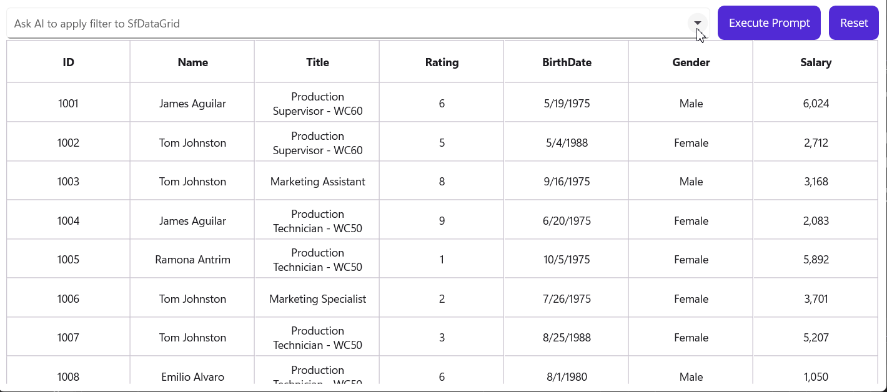

# **AI powered Natural Language Filtering in .NET MAUI DataGrid**

This demo shows AI powered Natural Language Filtering in .NET MAUI DataGrid.

## **Introduction**

Modern applications demand intuitive ways for users to interact with data. Instead of complex filter menus, imagine typing:

    Show orders above $500 from Alice

…and instantly seeing the filtered results. This is possible by combining **Syncfusion’s .NET MAUI DataGrid** with **AI-powered natural language processing using OpenAI**.

In this guide, we’ll cover how to implement **AI-powered natural language filtering** in a .NET MAUI DataGrid.

***

## **Why Natural Language Filtering?**

Traditional filtering requires users to know column names and conditions. Natural language filtering:

*   ✅ Improves user experience
*   ✅ Handles complex queries easily
*   ✅ Leverages AI to interpret intent

***
## Designing the UI
Use Syncfusion controls:
- **SfComboBox** for prompt input
- **SfButton** for Execute and Reset actions
- **SfDataGrid** for displaying filtered data

***

## Resources
- [Syncfusion .NET MAUI DataGrid](https://www.syncfusion.com/maui-controls/maui-datagrid)
- [OpenAI API](https://platform.openai.com/docs/)
- [GitHub Repository](https://github.com/SyncfusionExamples/AI-driven-Natural-Language-Filtering-in-.NET-MAUI-DataGrid/tree/master)

***

### How It Works
- **SfComboBox**: Allows users to enter natural language prompts or select suggestions.
- **Execute Prompt Button**: Sends the query to AI service for processing.
- **Reset Button**: Clears applied filters.
- **SfDataGrid**: Displays filtered data dynamically based on AI-generated predicates.

***

## **Conclusion**

 Thanks for reading! In this blog, we’ve seen AI powered Natural Language Filtering in [.NET MAUI DataGrid](https://www.syncfusion.com/maui-controls/maui-datagrid). Check out our [Release Notes](https://www.syncfusion.com/products/release-history) and [What’s New pages](https://www.syncfusion.com/products/whatsnew) to see the other updates in this release and leave your feedback in the comments section below. 
 For current Syncfusion customers, the newest version of Essential Studio is available from the [license and downloads page](https://www.syncfusion.com/Account/Login?ReturnUrl=%2faccount%2fdownloads). If you are not yet a customer, you can try our 30-day free [trial](https://www.syncfusion.com/downloads) to check out these new features. 
 For questions, you can contact us through our support [forums](https://www.syncfusion.com/forums), [feedback portal](https://www.syncfusion.com/feedback), or support [portal](https://support.syncfusion.com/). We are always happy to assist you!

