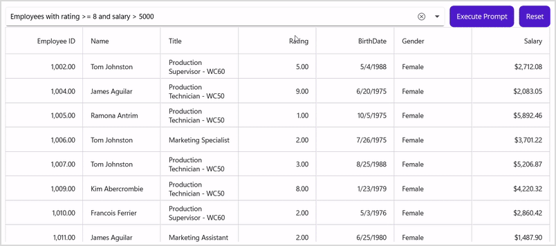

# **AI-Driven Natural Language Filtering in .NET MAUI DataGrid**

This demo shows how to showcase AI-Driven Natural Language Filtering in .NET MAUI DataGrid.

## **Introduction**

Modern applications demand intuitive ways for users to interact with data. Instead of complex filter menus, imagine typing:

    Show orders above $500 from Alice

…and instantly seeing the filtered results. This is possible by combining **Syncfusion’s .NET MAUI DataGrid** with **AI-powered natural language processing using OpenAI**.

In this guide, we’ll cover how to implement **AI-driven natural language filtering** in a .NET MAUI DataGrid.

***

## **Why Natural Language Filtering?**

Traditional filtering requires users to know column names and conditions. Natural language filtering:

*   ✅ Improves user experience
*   ✅ Handles complex queries easily
*   ✅ Leverages AI to interpret intent

***

## **Architecture Overview**

The solution consists of:

*   **UI Layer:** `SfDataGrid` bound to an `ObservableCollection<Employee>`.
*   **ViewModel:** Handles prompt execution and builds filter predicates.
*   **AI Service:** Converts natural language queries into structured filter plans using OpenAI.

### **Workflow**

1.  User enters query or selects a suggestion.
2.  AI service generates a `FilterPlan` (JSON schema).
3.  ViewModel converts `FilterPlan` into a `Predicate<object>`.
4.  DataGrid applies the filter dynamically.

***

## **Step 1: Configure AI Settings in `MauiProgram.cs`**

Register AI settings and services in the MAUI app builder:

```csharp
var openAiKey = Environment.GetEnvironmentVariable("OPENAI_API_KEY"); // or secure storage

builder.Services.AddSingleton(new AiSettings
{
    Provider = AiProvider.OpenAI, // or AiProvider.AzureOpenAI
    OpenAiApiKey = openAiKey,
    OpenAiModel = "gpt-4o-mini", // choose any chat model with JSON output
    AzureEndpoint = "", // For Azure OpenAI
    AzureApiKey = "",
    AzureDeployment = ""
});

builder.Services.AddSingleton<IAiFilterService, AiFilterService>();
builder.Services.AddSingleton<EmployeesViewModel>();
builder.Services.AddTransient<MainPage>();
```

***

## **Step 2: Bind DataGrid and ViewModel in `MainPage.xaml.cs`**

```csharp
public partial class MainPage : ContentPage
{
    private readonly EmployeesViewModel _vm;

    public MainPage()
    {
        InitializeComponent();

        var aiSettings = new AiSettings { Provider = AiProvider.Local }; // or OpenAI/Azure
        var aiService = new AiFilterService(aiSettings);
        _vm = new EmployeesViewModel(aiService);
        BindingContext = _vm;

        _vm.FilterChanged += (_, __) =>
        {
            DataGrid.View.Filter = _vm.BuildPredicate();
            DataGrid.View.RefreshFilter();
        };
    }
}
```

***

## **Step 3: ViewModel Logic (`EmployeesViewModel.cs`)**

*   **Prompt Suggestions:**
    *   “Employees with rating ≥ 8 and salary > 5000”
    *   “Show only Female employees born before 1990”

*   **Commands:**
    *   `ExecutePromptCommand` → Calls AI service
    *   `ResetCommand` → Clears filters

```csharp
private async Task ExecuteAsync()
{
    var toRun = !string.IsNullOrWhiteSpace(SelectedSuggestion) ? SelectedSuggestion! : Prompt;
    if (string.IsNullOrWhiteSpace(toRun))
    {
        CurrentPlan = null;
        FilterChanged?.Invoke(this, EventArgs.Empty);
        return;
    }

    CurrentPlan = await _ai.CreateFilterPlanAsync(toRun);
    FilterChanged?.Invoke(this, EventArgs.Empty);
}
```

***

## **Step 4: AI Service (`AIFilterService.cs`)**

*   Sends prompt to OpenAI/Azure OpenAI with schema instructions.
*   Receives JSON filter plan like:

```json
{
  "logic": "and",
  "conditions": [
    { "condition": { "field": "Rating", "op": "gte", "value": "8" } },
    { "condition": { "field": "Salary", "op": "gt", "value": "5000" } }
  ]
}
```

*   Converts JSON into `FilterPlan` for evaluation.

**Local mode** uses regex to parse common phrases like:

*   “salary between 3000 and 4000”
*   “gender in \[Male, Female]”
*   “birthdate before 1990”

***

## **Step 5: Bind XAML**

```xml
<Grid RowDefinitions="Auto, *" Padding="10">
    <Grid ColumnDefinitions="*, Auto, Auto" ColumnSpacing="10">
        <input:SfComboBox
            x:Name="PromptCombo"
            ItemsSource="{Binding PromptSuggestions}"
            SelectedItem="{Binding SelectedSuggestion}"
            Text="{Binding Prompt, Mode=TwoWay}"
            IsEditable="True"
            Placeholder="Ask AI to apply filter to SfDataGrid"
            MaxDropDownHeight="260"
            HeightRequest="40" />

        <Button Grid.Column="1" Text="Execute Prompt"
                Command="{Binding ExecutePromptCommand}" />
        <Button Grid.Column="2" Text="Reset"
                Command="{Binding ResetCommand}" />
    </Grid>

    <sfgrid:SfDataGrid x:Name="DataGrid"
                       Grid.Row="1" RowHeight="50"
                       ColumnWidthMode="Fill"
                       GridLinesVisibility="Both"
                       HeaderGridLinesVisibility="Both"
                       ItemsSource="{Binding Employees}"
                       SortingMode="Multiple">
        <sfgrid:SfDataGrid.Columns>
            <sfgrid:DataGridNumericColumn MappingName="EmployeeId" HeaderText="Employee ID" />
            <sfgrid:DataGridTextColumn MappingName="Name" />
            <sfgrid:DataGridTextColumn MappingName="Title" />
            <sfgrid:DataGridNumericColumn MappingName="Rating" />
            <sfgrid:DataGridDateColumn MappingName="BirthDate" Format="d" />
            <sfgrid:DataGridTextColumn MappingName="Gender" />
            <sfgrid:DataGridNumericColumn MappingName="Salary" Format="$#,0.00" />
        </sfgrid:SfDataGrid.Columns>
    </sfgrid:SfDataGrid>
</Grid>
```

---

### How It Works
- **SfComboBox**: Allows users to enter natural language prompts or select suggestions.
- **Execute Prompt Button**: Sends the query to AI service for processing.
- **Reset Button**: Clears applied filters.
- **SfDataGrid**: Displays filtered data dynamically based on AI-generated predicates.


## **Step 6: Apply Filter**

`BuildPredicate()` converts `FilterPlan` into a predicate:

```csharp
public Predicate<object>? BuildPredicate()
{
    if (CurrentPlan is null) return null;
    return rowObj => EvalPlan(CurrentPlan, (Employee)rowObj);
}
```

`EvalCondition()` supports operators:

*   **Numeric:** gt, gte, lt, lte, between
*   **String:** contains, startswith, endswith, in
*   **Date:** before, after

***



## **Conclusion**

 Thanks for reading! In this blog, we’ve seen how to showcase bulk editing in [.NET MAUI DataGrid](https://www.syncfusion.com/maui-controls/maui-datagrid). Check out our Release Notes[https://www.syncfusion.com/products/release-history] and [What’s New pages](https://www.syncfusion.com/products/whatsnew) to see the other updates in this release and leave your feedback in the comments section below. 
 For current Syncfusion customers, the newest version of Essential Studio is available from the [license and downloads page](https://www.syncfusion.com/Account/Login?ReturnUrl=%2faccount%2fdownloads). If you are not yet a customer, you can try our 30-day free [trial](https://www.syncfusion.com/downloads) to check out these new features. 
 For questions, you can contact us through our support [forums](https://www.syncfusion.com/forums), [feedback portal](https://www.syncfusion.com/feedback), or support [portal](https://support.syncfusion.com/). We are always happy to assist you!

